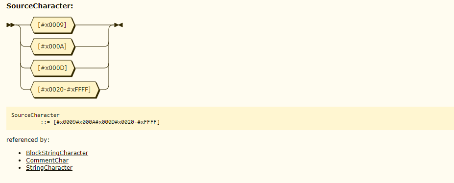

Graphql 语法 EBNF 定义
----------------------

根据 June 2018 版本的 GraphQL 语法定义转写的 EBNF 定义.   
创建该 repo 的目的是更方便地编写 GraphQL Parser 和 Lexer.  

## EBNF

### 预览:  

```EBNF
/* SourceCharacter Expression */
SourceCharacter ::=  #x0009 | #x000A | #x000D | [#x0020-#xFFFF] /* /[\u0009\u000A\u000D\u0020-\uFFFF]/ */
/* Ignored Tokens Expression */
Ignored        ::= UnicodeBOM | WhiteSpace | LineTerminator | Comment | Comma
UnicodeBOM     ::= #xFEFF  /* Byte Order Mark (U+FEFF) */
WhiteSpace     ::= #x0009 | #x0020 /* ASCII: \t | Space, Horizontal Tab (U+0009), Space (U+0020) */
LineTerminator ::= #x000A | #x000D | #x000D#x000A   /* ASCII: \n | \r\n | \r, New Line (U+000A) | Carriage Return (U+000D) [Lookahead != New Line (U+000A)] | Carriage Return (U+000D)New Line (U+000A) */
Comment        ::= "#" CommentChar* LineTerminator
CommentChar    ::= SourceCharacter - LineTerminator
Comma          ::= ","

...
```

### 详情:
-  [GraphQL-Grammar-EBNF-Definition-June-2018-Edition](./DOCUMENTS/June-2018-Edition/GraphQL-Grammar-EBNF-Definition-June-2018-Edition.ebnf)  


## 语法图 (铁路图)

### 预览 (通过 [Railroad Diagram Generator](https://bottlecaps.de/rr/ui) 生成):  



### 详情:
- [GraphQL-Grammar-Diagram-June-2018-Edition](./DOCUMENTS/June-2018-Edition/GraphQL-Grammar-Diagram-June-2018-Edition.xhtml)

## 作者
- karminski

## 协议
- MIT