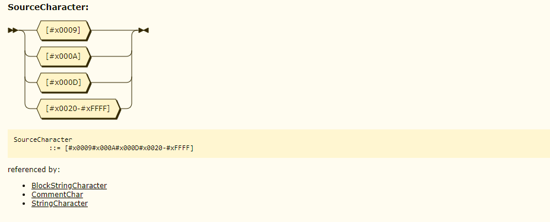

GraphQL Grammar EBNF Definition
-------------------------------

( [English](./README.md) | [中文](./README-zh-CN.md) )

GraphQL grammar EBNF definition arranged by GraphQL specification June 2018.  
This repo was created to build a GraphQL lexer & parser easily.  


## EBNF

### Preview:  

```EBNF
/* SourceCharacter Expression */
SourceCharacter ::=  #x0009 | #x000A | #x000D | [#x0020-#xFFFF] /* /[\u0009\u000A\u000D\u0020-\uFFFF]/ */
/* Ignored Tokens Expression */
Ignored        ::= UnicodeBOM | WhiteSpace | LineTerminator | Comment | Comma
UnicodeBOM     ::= #xFEFF  /* Byte Order Mark (U+FEFF) */
WhiteSpace     ::= #x0009 | #x0020 /* ASCII: \t | Space, Horizontal Tab (U+0009), Space (U+0020) */
LineTerminator ::= #x000A | #x000D | #x000D#x000A   /* ASCII: \n | \r\n | \r, New Line (U+000A) | Carriage Return (U+000D) [Lookahead != New Line (U+000A)] | Carriage Return (U+000D)New Line (U+000A) */
Comment        ::= "#" CommentChar* LineTerminator
CommentChar    ::= SourceCharacter - LineTerminator
Comma          ::= ","

...
```

### Full version:
-  [GraphQL-Grammar-EBNF-Definition-June-2018-Edition](./DOCUMENTS/June-2018-Edition/GraphQL-Grammar-EBNF-Definition-June-2018-Edition.ebnf)  


## Syntax Diagram (Railroad Diagram)

### Preview (Generated by [Railroad Diagram Generator](https://bottlecaps.de/rr/ui)):  



### Full Version:
- [GraphQL-Grammar-Diagram-June-2018-Edition](./DOCUMENTS/June-2018-Edition/GraphQL-Grammar-Diagram-June-2018-Edition.xhtml)

## Author
- karminski

## License
- MIT